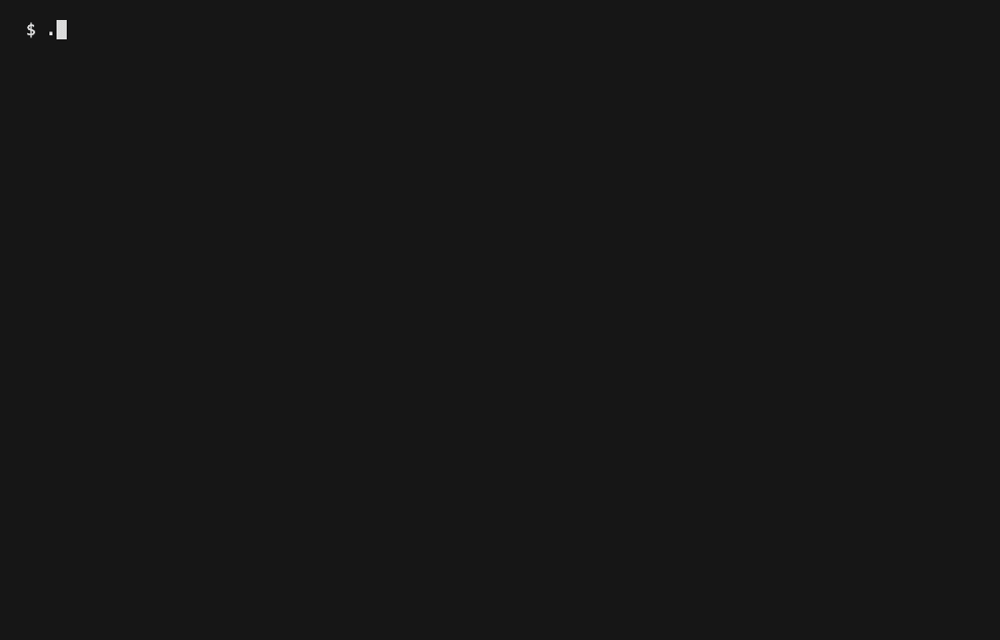

# bedrock-pack-tools

[English](README.md) | Русский

[](https://github.com/iteplenky/bedrock-pack-tools/releases/latest)
[](https://github.com/iteplenky/bedrock-pack-tools/actions/workflows/test.yml)
[](https://pkg.go.dev/github.com/iteplenky/bedrock-pack-tools/v3)
[](LICENSE)

**Одна команда превращает зашифрованные ресурс-паки сервера Minecraft Bedrock в обычные папки, которые можно открыть и редактировать.**

bedrock-pack-tools подключается к серверу Bedrock так же, как это делает игра: забирает AES-ключи, которые сервер выдает клиенту, скачивает все паки и расшифровывает их прямо у вас на диске. Ключ заранее не нужен. Пригодится, если вы держите свой сервер и хотите посмотреть, что он раздает игрокам; если сами собрали пак и потеряли к нему ключ; или если просто изучаете протокол.

```bash
bedrock-pack-tools download --decrypt play.example.net:19132
```

<p align="center">
  
</p>

## Установка

Готовым бинарникам не нужен установленный Go. На macOS или Linux скачайте сборку под свою систему, распакуйте и запустите:

```bash
curl -L https://github.com/iteplenky/bedrock-pack-tools/releases/latest/download/bedrock-pack-tools_darwin_arm64.tar.gz | tar xz
./bedrock-pack-tools --help
```

На Windows скачайте `bedrock-pack-tools_windows_amd64.zip` из [последнего релиза](https://github.com/iteplenky/bedrock-pack-tools/releases/latest), распакуйте и запустите из PowerShell:

```powershell
.\bedrock-pack-tools.exe --help
```

<details>
<summary>Все платформы и проверка скачанного</summary>

<br>

| Система | Архив |
|---|---|
| macOS, Apple Silicon (M1/M2/M3) | `bedrock-pack-tools_darwin_arm64.tar.gz` |
| macOS, Intel | `bedrock-pack-tools_darwin_amd64.tar.gz` |
| Linux, большинство ПК и серверов | `bedrock-pack-tools_linux_amd64.tar.gz` |
| Linux, ARM (например, Raspberry Pi 64-бит) | `bedrock-pack-tools_linux_arm64.tar.gz` |
| Windows, большинство ПК | `bedrock-pack-tools_windows_amd64.zip` |
| Windows, ARM | `bedrock-pack-tools_windows_arm64.zip` |

В каждом релизе лежит `checksums.txt`, так что скачанное легко проверить командой `sha256sum -c checksums.txt`.

</details>

Хотите собрать сами? Понадобится Go 1.25 или новее:

```bash
go install github.com/iteplenky/bedrock-pack-tools/v3@latest
```

Суффикс `/v3` оставьте, это часть пути модуля. Бинарник попадет в `$(go env GOPATH)/bin`; если нужно, добавьте этот каталог в `PATH`.

## Как пользоваться

Команда из начала readme и есть самое главное: указываете сервер, и программа скачивает все паки, а затем сразу их расшифровывает. При первом запуске нужно один раз войти через Xbox Live: появится короткий код, вы вставляете его на открывшейся странице, и дальше токен берется из кеша. Когда все закончится, рядом появится папка `play.example.net/`: расшифрованные паки лежат в `decrypted/`, а в `keys.json` записано, какому UUID пака какой ключ соответствует.

Если запустить без аргументов, откроется интерактивное меню. Так удобнее начинать:

```bash
bedrock-pack-tools
```

Оттуда можно открыть список featured-серверов из игры, ввести любой адрес и выбрать, что с ним сделать, заново расшифровать уже скачанное, собрать пак обратно или переключить язык интерфейса между русским и английским. Везде виден прогресс: `p` ставит на паузу, `esc` возвращает назад.

## Команды

| Команда | Что делает | Пример |
| --- | --- | --- |
| `keys` | Снять AES-ключи сервера в `keys.json` | `bedrock-pack-tools keys play.example.net:19132` |
| `download` | Скачать все паки сервера вместе с ключами | `bedrock-pack-tools download --decrypt play.example.net:19132` |
| `decrypt` | Превратить зашифрованный пак в обычную папку | `bedrock-pack-tools decrypt --all keys.json packs/` |
| `encrypt` | Собрать обычный пак в `.mcpack` + `.mcpack.key` | `bedrock-pack-tools encrypt my-pack/` |
| `featured` | Открыть игровой каталог Featured Servers / Live Events и скачать оттуда | `bedrock-pack-tools featured` |
| `login` | Войти через Xbox Live и сохранить токен | `bedrock-pack-tools login` |
| `logout` | Удалить сохраненные файлы Xbox и MCToken | `bedrock-pack-tools logout` |
| `version` | Показать версию сборки | `bedrock-pack-tools version` |

Несколько вещей, которые не влезли в таблицу:

- `download` складывает каждый сервер в отдельную папку `<server>/` (паки, `keys.json` и, если добавить `--decrypt`, подпапку `decrypted/`), так что загрузки с разных серверов не перемешиваются и не затирают друг друга по имени пака. Без `--decrypt` программа просто подскажет команду `decrypt --all`, которую можно запустить потом. Флаг `-v` включает подробный лог передачи.
- `decrypt --all <keys.json> <packs-dir>` сопоставляет паки и ключи по UUID из `manifest.json` каждого пака, поэтому раскладка папок не важна.
- `encrypt` генерирует новый 32-символьный ключ AES-256-CFB8 для каждого файла. Можно передать свой, а флаг `--key-out PATH` сохранит мастер-ключ за пределами папки пака.
- `featured` помечает каждую строку: `[ON]` / `[OFF]` (публичный `host:port`, который удалось или не удалось пингануть по RakNet), `[EXP]` (адрес берется из `experienceId` при скачивании) или `[EVT]` (live-событие, тоже разворачивается при скачивании). Скачать запись можно через `featured download <index>`.

Команда `bedrock-pack-tools <command> --help` покажет полный синтаксис любой команды, а за внутренним устройством загляните в [godoc](https://pkg.go.dev/github.com/iteplenky/bedrock-pack-tools/v3).

<details>
<summary>Файл <code>keys.json</code></summary>

<br>

`keys` и `download` сохраняют соответствие UUID пака и его параметров шифрования, которое потом читает `decrypt --all`:

```json
{
  "12345678-1234-1234-1234-123456789abc": {
    "key": "ABCDEFGHIJKLMNOPQRSTUVWXYZ123456",
    "version": "1.0.0",
    "name": "Example Pack"
  }
}
```

Ключи отдельных файлов лежат внутри `contents.json` каждого зашифрованного пака, и программа достает их сама, как только получит мастер-ключ. Бинарный формат зашифрованного пака описан в [godoc](https://pkg.go.dev/github.com/iteplenky/bedrock-pack-tools/v3).

</details>

### Вход в аккаунт

Командам `keys`, `download` и `featured` нужен аккаунт Microsoft, потому что они общаются с Xbox Live. При первом запуске вы увидите примерно такое:

```
Auth: no cached token - starting Xbox Live device auth
A URL and code will appear - enter it in your browser.
```

Дальше токен переиспользуется. `featured` вдобавок держит отдельный токен PlayFab, который живет около четырех часов. Все это лежит в каталоге настроек вашей ОС:

- macOS: `~/Library/Application Support/bedrock-pack-tools/`
- Linux: `~/.config/bedrock-pack-tools/`
- Windows: `%AppData%\bedrock-pack-tools\`

## Частые вопросы

**Как открыть `.mcpack`?**
Это обычный zip-архив: переименуйте его в `.zip` и распакуйте. Если внутри все выглядит как мусор (`contents.json` начинается с бинарного заголовка), сначала расшифруйте пак.

**Что за 32-символьный ключ?**
Это мастер-ключ пака (AES-256). IV - это первые 16 байт ключа, а ключи отдельных файлов лежат внутри зашифрованного `contents.json`.

**Это вообще законно?**
Запускайте на серверах, которыми вы управляете или которые вам разрешено тестировать, и с паками, на которые у вас есть права. Подробнее в разделе [Ответственное использование](#ответственное-использование).

<details>
<summary>Если что-то пошло не так</summary>

<br>

- **`featured` пустой или показывает не те серверы, что в игре.** Mojang раздает каталог по когортам PlayFab, привязанным к стабильному `.device_id`. Откройте настройки и сбросьте featured-когорту (пункт Reset featured cohort) либо удалите `.device_id`, чтобы получить новую.
- **Строка `[EVT]` не скачивается.** Сейчас у этого события нет активной площадки, о чем программа и сообщит. Подождите или выберите другую строку.
- **Расшифровка выдает мусор.** Либо ключ не тот, либо пак скачался не полностью. Запустите `download -v` и проверьте, что передача дошла до конца.
- **Программа снова и снова просит device code.** Каталог с кешем токена (см. [Вход в аккаунт](#вход-в-аккаунт)) недоступен для записи (обычное дело в песочницах), поэтому каждый запуск начинает вход заново.

</details>

## Переменные окружения

| Переменная | Что делает |
| --- | --- |
| `NO_COLOR` | Отключить все ANSI-цвета ([no-color.org](https://no-color.org/)) |
| `BPT_DIAL_TIMEOUT` | Задать таймаут подключения для `keys` / `download` в формате Go duration (`5m`, `90s`). Ограничивает весь запуск целиком, включая загрузки с CDN. |
| `BPT_LANG` | Жестко задать язык интерфейса (`en` или `ru`); иначе он берется из вашей локали. То же самое делает флаг `--lang` / `-lang`. |

## Ответственное использование

Инструмент рассчитан на тех, кто проверяет собственные серверы, восстанавливает свои ключи или занимается честным исследованием. Запускайте его на серверах, которыми вы управляете или которые вам разрешено тестировать, и с паками, к которым у вас есть законный доступ; не используйте его, чтобы перепродавать или распространять чужой платный контент. Ответственность за соблюдение законов и правил сервисов, к которым вы подключаетесь, лежит на вас (см. [LICENSE](LICENSE)).

Сохраненные токены (`.xbox_token.json`, `.mctoken.json`) и любой созданный вами `keys.json` - это настоящие учетные данные: токены открывают доступ к вашему аккаунту, а ключи расшифровывают контент. Держите каталог настроек при себе и не выкладывайте его содержимое.

## Как помочь проекту

Issues и pull request-ы приветствуются; по всему нетривиальному лучше сначала завести issue и обсудить. Перед отправкой прогоните `go build ./... && go test ./...` и оформляйте заголовки коммитов по conventional commits (`feat:`, `fix:`, `docs:`, ...). Полный список проверок есть в [CONTRIBUTING.md](CONTRIBUTING.md).

## Лицензия

MIT. Делайте что угодно, только сохраняйте текст лицензии. См. [LICENSE](LICENSE).
